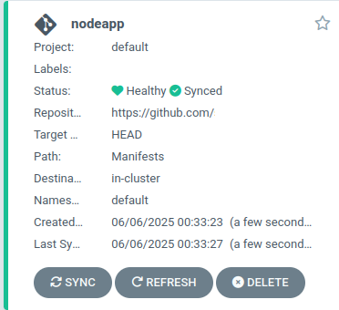
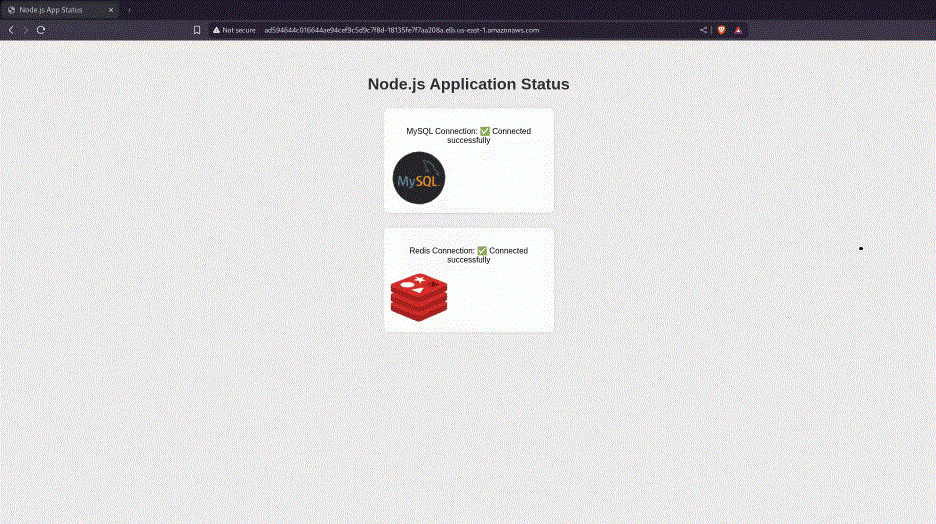

# 🚀 DevOps Capstone Project – GitOps CI/CD Pipeline on AWS

## 📘 Project Overview

This project demonstrates the creation of a **production-ready GitOps CI/CD pipeline** on AWS using modern DevOps tools. It provisions infrastructure using **Terraform**, manages CI/CD workflows using **Jenkins** and **ArgoCD**, secures sensitive information using **External Secrets Operator**, and deploys a **Node.js web application** with **MySQL** and **Redis** on **Amazon EKS**.

# 🔷 Infrastructure Architecture


# ✅ Infrastructure Provisioning – Terraform

Provisioned using only Terraform:

- **VPC** with 3 public and 3 private subnets across 3 Availability Zones.
- **NAT Gateway**, **Internet Gateway**, and **Route Tables**.

- **Amazon EKS Cluster**
  - Control Plane and Managed Node Groups inside **private subnets**.
  - **EBS CSI driver** enabled for secure service integrations and dynamic volume provisioning
- **OIDC Provider** enabled to allow secure IAM roles for Kubernetes service accounts (IRSA).

## 🔐 OIDC Provider Configuration for IRSA (IAM Roles for Service Accounts)

To enable secure and fine-grained access control between Kubernetes service accounts and AWS services, we configured an OIDC (OpenID Connect) provider for the EKS cluster

### ✅ OIDC Provider Creation

Provisioned via Terraform and associated with the EKS cluster to enable IRSA.
####📁 Terraform module location:
OIDC module: [Terraform/Modules/oidc](./Terraform/Modules/oidc)

### 🔐 IAM Roles & Service Account Bindings

To securely allow Kubernetes service accounts to interact with AWS resources, we configured IAM Roles with attached policies for each service account using IRSA (IAM Roles for Service Accounts). Here are the details:

#### **External Secrets Operator (ESO)**

- **IAM Role & Service Account:** Defined in the `main.tf` file inside the [Terraform/Modules/oidc](./Terraform/Modules/oidc)

- **Permissions:** Allows ESO to fetch secrets from AWS Secrets Manager, including actions like `secretsmanager:GetSecretValue` and `secretsmanager:DescribeSecret`.

#### **EBS CSI Driver**

- **IAM Role & Service Account:** Defined inside the [Terraform/Modules/ebs_csi_driver module](./Terraform/Modules/ebs_csi_driver)
- **Permissions:** The IAM Role is attached to the AWS managed policy `AmazonEBSCSIDriverPolicy`, which grants all necessary permissions for the driver to dynamically create, attach, delete, and manage EBS volumes. This includes actions like `ec2:CreateVolume`, `ec2:AttachVolume`, and others required to manage storage lifecycle.

## 📦 EBS Storage Class Configuration

To support dynamic Persistent Volume provisioning for stateful workloads such as MySQL and Jenkins, we created a default StorageClass backed by Amazon EBS with the following configuration:

- **gp3 volume type** used for better baseline performance and cost optimization.

- Marked as the **default storage class** to allow automatic volume provisioning when no specific class is defined in PVCs.

- **volumeBindingMode**: WaitForFirstConsumer ensures volumes are created only after the pod is scheduled, ensuring proper AZ alignment.
- Used by both Jenkins (for persistent job/workspace data) and MySQL (to store database files securely).

> 📂 YAML file location: You can find the StorageClass definition in [`/Manifests/storageclass.yaml`](./Manifests/storageClass.yaml)

# ⚙️ Continuous Integration – Jenkins

-----> jenkins part

- installations and setup via Helm and mentions to values.yaml if used
- Jenkins UI Configuration and mentions to credentials that u used in pipeline
- Jenkins Pipeline stages

# 🚀 Continuous Deployment – ArgoCD + Argo Image Updater

- Create ArgoCD namespace

```bash
kubectl create ns argocd
```

- ArgoCD installation via Helm

```bash
helm repo add argo https://argoproj.github.io/argo-helm
helm install -n argocd argocd argo/argo-cd --version 8.0.14
```

- Get ArgoCD initial password

```bash
kubectl -n argocd get secret argocd-initial-admin-secret -o jsonpath="{.data.password}" | base64 -d
```

- Setup ArgoCD application



- Install ArgoCD image updater with values

```bash
helm install -n argocd argocd-image-updater argo/argocd-image-updater --version 0.12.2 -f Helm/argo_imageupdater_values.yaml
```

- Add image updater annotations

```yaml
argocd-image-updater.argoproj.io/write-back-method: git:secret:argocd/git-creds
argocd-image-updater.argoproj.io/image-list: 339007232055.dkr.ecr.us-east-1.amazonaws.com/my-ecr:1.x
argocd-image-updater.argoproj.io/myapp.update-strategy: semver
```


- Wait For the image update event


- ArgoCD pushes the new version to Github and updates the Deployment


# 🔐 External Secrets Operator with AWS Secrets Manager

This guide explains how to set up the **External Secrets Operator** with **AWS Secrets Manager** to automatically sync secrets into your Kubernetes cluster.

---

## 🛠️ **Installation**

### 1️⃣ **Add the Helm Repository:**

```bash
helm repo add external-secrets-operator https://charts.external-secrets.io/
```

### 2️⃣ **Install the External Secrets Operator:**

```bash
helm install external-secrets external-secrets/external-secrets \
  -n external-secrets --create-namespace \
  --set serviceAccount.name=external-secrets \
  --set serviceAccount.annotations."eks\.amazonaws\.com/role-arn"=arn:aws:iam::<ACCOUNT_ID>:role/external-secrets-irsa\
  --set installCRDs=true
```

### 3️⃣ **Verify Installation:**

```bash
kubectl get pods -n external-secrets
```

---

## 🔐 **Connect to AWS Secrets Manager**

### 1️⃣ **Export the AWS Credentials**

```bash
export AWS_ACCESS_KEY_ID=$(aws configure get aws_access_key_id --profile default)
export AWS_SECRET_ACCESS_KEY=$(aws configure get aws_secret_access_key --profile default)

```

### 2️⃣ **Create a Kubernetes Secret with AWS Credentials**

Now, create a Kubernetes secret containing your AWS access credentials:

```bash
kubectl create secret generic aws-credentials \
  -n external-secrets \
  --from-literal=access-key-id=$AWS_ACCESS_KEY_ID \
  --from-literal=secret-access-key=$AWS_SECRET_ACCESS_KEY
```

---

### 3️⃣ **Create a ClusterSecretStore**

Now, Apply the K8s Manifests

```bash
kubectl apply -f k8s/secrets
```

## ✅ **Verify the Synced Secret**

You can verify that the secret has been synced successfully by checking the secret in your Kubernetes cluster:

```bash
kubectl get secrets
```

## ✅ **Verify the Secret has right values**

You can verify that the secret has the same values in the secret manager in your Kubernetes cluster :

```bash
kubectl get secret <SECRET_NAME>  -o jsonpath="{.data}" | jq 'to_entries[] | "\(.key): \(.value | @base64d)"'
```

---

## 🛠 **Using the Secrets in Your Application**

Now, in your _Deployment_ manifest, reference the synced secret:

```yaml
env:
  - name: DB_USERNAME
    valueFrom:
      secretKeyRef:
        name: mysql-k8s-secret
        key: username
  - name: DB_PASSWORD
    valueFrom:
      secretKeyRef:
        name: mysql-k8s-secret
        key: password
```

---

This setup will allow the **External Secrets Operator** to automatically sync secrets from **AWS Secrets Manager** into your Kubernetes cluster and make them available to your applications securely.

# 🐍 Application – Node.js + MySQL + Redis

This section describes the deployment process for a Node.js web application integrated with MySQL and Redis inside the EKS cluster.

### 🛢️ 1. MySQL Deployment via Bitnami Helm Chart

**🧪 Authentication Prerequisite**

Before installing the MySQL Helm chart from DockerHub OCI registry, authenticated using:

```bash
helm registry login registry-1.docker.io
Username: <your_dockerhub_username>
Password: <your_dockerhub_password_or_token>

```

**📦 Installation Command**

```bash
helm install my-mysql oci://registry-1.docker.io/bitnamicharts/mysql -f mysql_values.yaml --namespace default
```

**⚙️ mysql Configuration**

To securely configure MySQL authentication within your Kubernetes cluster, we use Terraform, AWS Secrets Manager, and the Bitnami MySQL Helm chart together. The Helm chart expects specific secret key names, and we make sure those are correctly provided via automation.

**✅ Required Secret Keys (Expected by Bitnami MySQL Chart)**

- The Bitnami chart is designed to look for a Kubernetes Secret with the following keys:
  `mysql-root-password`,`mysql_hostname`,`mysql-username`,`mysql-password`,`mysql_port`
- so we use `mysql_values.yaml` to override default Bitnami MySQL Helm chart settings. It instructs the chart to use an existing Kubernetes Secret `mysql-k8s-secret` and maps specific keys for the credentials.

📁 File Location: [Helm/mysql_values.yaml](./Helm/mysql_values.yaml)

✅ Validation
Verified the MySQL deployment using a MySQL client pod:

```bash
kubectl run my-mysql-client --rm --tty -i --restart='Never' --image  docker.io/bitnami/mysql:9.3.0-debian-12-r0 --namespace default --env MYSQL_ROOT_PASSWORD=$MYSQL_ROOT_PASSWORD --command -- bash
```

### ⚡ 2. Redis Deployment

**📦 Installation Command**

```bash
helm install redis bitnami/redis --set auth.enabled=false --namespace default
```

We created a secret containing the Redis hostname and port, which is injected as environment variables into the Node.js application to enable seamless connection to the Redis service.

### 🔧 3. Node.js Application

#### **📁 Application Directory Structure**

The application source code and Dockerfile are located under the [Applications](./Applications) directory.

#### **🐳 Docker Image Build & Push to ECR**

To containerize the application and push it to Amazon Elastic Container Registry (ECR), the following steps were executed:

1. **Authenticate Docker with ECR:**

```bash
aws ecr get-login-password --region us-east-1 | docker login --username AWS --password-stdin 339007232055.dkr.ecr.us-east-1.amazonaws.com
```

2. Build and Push Image to ECR:

```bash
# Build the Docker image from the Application directory
docker build -t my-ecr/nodejs-mysql-redis ./Application

# Tag the image for ECR
docker tag my-ecr/nodejs-mysql-redis:latest 339007232055.dkr.ecr.us-east-1.amazonaws.com/my-ecr:latest

# Push the image to ECR
docker push 339007232055.dkr.ecr.us-east-1.amazonaws.com/my-ecr:latest

```

> This image is later pulled by the Kubernetes deployment running inside EKS.

#### 🚀 Deployment via Kubernetes

- The deployment manifest for the Node.js application is defined under the [Manifests](./Manifests) directory.
- This includes:
  - **nodejs_deployment.yaml:** Defines the Kubernetes Deployment for the Node.js app.
  - **service.yaml:** Defines the Service resource with LoadBalancer type to expose the application externally.

#### 🔐 Environment Variables and Secrets Integration

- The application requires environment variables to connect to MySQL and Redis.
- These values (such as `MYSQL_HOST`, `MYSQL_USER`, `MYSQL_PASSWORD`, etc.) are securely sourced from Kubernetes Secrets and injected into the Node.js pod to enable seamless connectivity to these backend services.
- The secrets themselves are dynamically synced from **AWS Secrets Manager** using the **External Secrets Operator (ESO).**

## 🌐 Application Access



---

# References:

[Artifact hub](https://artifacthub.io/packages/Helm/external-secrets-operator/external-secrets?modal=install) <br>
[External Secrets Operator](https://external-secrets.io/latest/)
